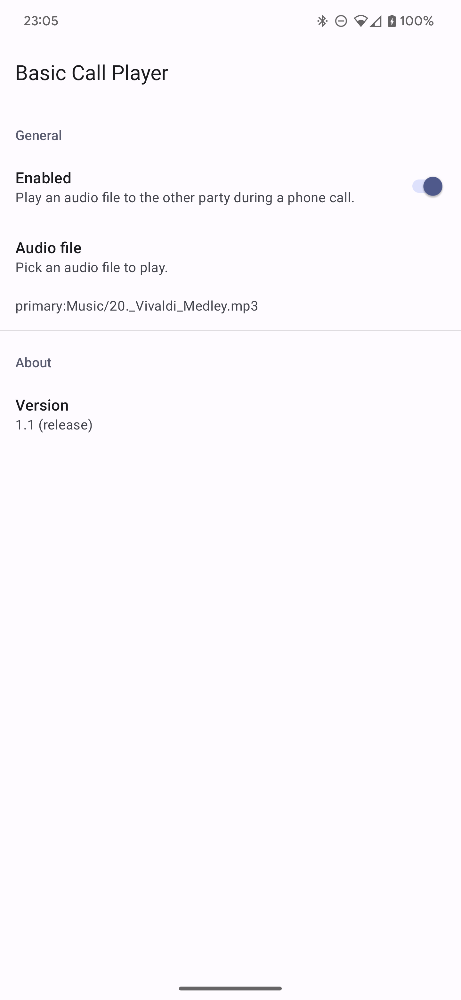
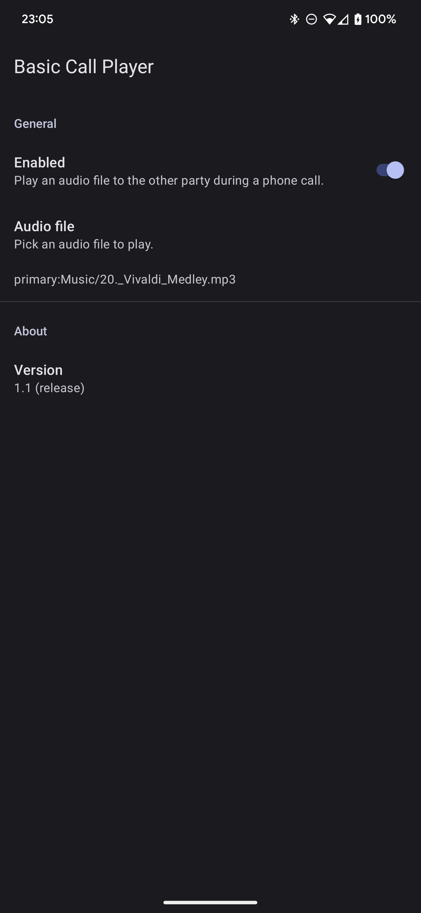

# Basic Call Player


BCP is a tech demo application that plays an audio file to the other party when a phone call is active.

 

### Usage

1. Download the latest version from the [releases page](https://github.com/chenxiaolong/BCP/releases). To verify the digital signature, see the [verifying digital signatures](#verifying-digital-signatures) section.

2. Install BCP as a system app.

    **For devices rooted with Magisk**, simply flash the zip as a Magisk module from within the Magisk app.

    **For unrooted custom firmware**, the files from the `system/` folder in the zip will need to be baked into the system image (or otherwise made available on the actual `/system` volume).

3. Reboot and open BCP.

4. Enable call playback. When enabling for the first time, BCP will ask for notification permissions on Android 13+. This is required for the background service to bring itself to the foreground when a phone call is active.

5. Select an audio file to play during phone calls.

6. To install future updates, there are a couple methods:

    * If installed via Magisk, the module can be updated right from Magisk Manager's modules tab. Flashing the new version in Magisk manually also works just as well.
    * The `.apk` can also be extracted from the zip and be directly installed. With this method, the old version exists as a system app and the new version exists as a user-installed update to the system app. This method is more convenient if BCP is baked into the Android firmware image.

### It doesn't work!

It only works on devices that implement the telephony audio output device. Newer Google Pixel devices do, for example, because it's needed for Google Dialer's call screening feature.

### How it works

The phone call detection mechanism is [the same as in BCR](https://github.com/chenxiaolong/BCR#how-it-works).

The telephony output works by simply using the `MODIFY_PHONE_STATE` privileged system permission and creating an `AudioTrack` instance for the telephony output device.

### Verifying digital signatures

Both the zip file and the APK contained within are digitally signed.

To verify the signature of the zip file, first retrieve the public key: `2233C479609BDCEC43BE9232F6A3B19090EFF32C`. This is the same key used to sign the git tags in this repository.

```bash
gpg --recv-key 2233C479609BDCEC43BE9232F6A3B19090EFF32C
```

Then, verify the signature of the zip file.

```bash
gpg --verify BCP-<version>-release.zip.asc BCP-<version>-release.zip
```

The command output should include both `Good signature` and the GPG fingerprint listed above.

To verify the signature of the APK, extract it from the zip and then run:

```
apksigner verify --print-certs system/priv-app/com.chiller3.bcp/app-release.apk
```

The SHA-256 digest of the APK signing certificate is:

```
d16f9b375df668c58ef4bb855eae959713d6d02e45f7f2c05ce2c27ae944f4f9
```

### Building from source

BCP can be built like most other Android apps using Android Studio or the gradle command line.

To build the APK:

```bash
./gradlew assembleDebug
```

To build the Magisk module zip (which automatically runs the `assembleDebug` task if needed):

```bash
./gradlew zipDebug
```

The output file is written to `app/build/distributions/debug/`. The APK will be signed with the default autogenerated debug key.

To create a release build with a specific signing key, set up the following environment variables:

```bash
export RELEASE_KEYSTORE=/path/to/keystore.jks
export RELEASE_KEY_ALIAS=alias_name

read -r -s RELEASE_KEYSTORE_PASSPHRASE
read -r -s RELEASE_KEY_PASSPHRASE
export RELEASE_KEYSTORE_PASSPHRASE
export RELEASE_KEY_PASSPHRASE
```

and then build the release zip:

```bash
./gradlew zipRelease
```

### Contributing

Unlike [BCR](https://github.com/chenxiaolong/BCR), this project is meant as just a fun little project to demonstrate how to play audio to the telephony output device. I do not plan on doing any updates and am unlikely to accept contributions beyond small things, like translations. Please consider coming up with other interesting use cases and adding a similar feature to your own apps instead!

### License

BCP is licensed under GPLv3. Please see [`LICENSE`](./LICENSE) for the full license text.